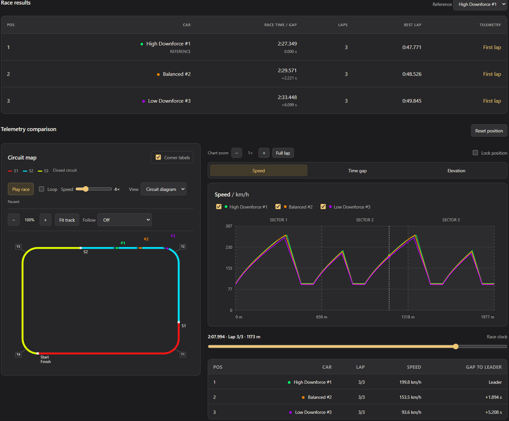
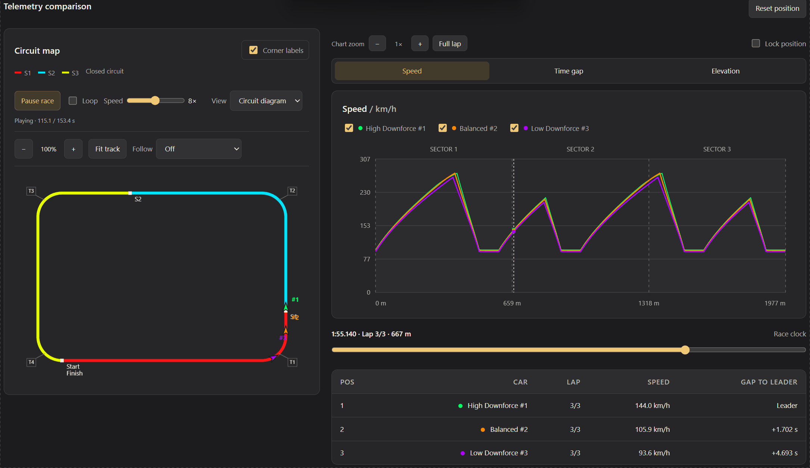

# Lap Lab

An unofficial F1 lap time simulator in C++.


Lap Lab is a personal project made for fun and experimentation. It uses simplified physics and approximate circuit data, and is not intended for professional engineering, high-fidelity vehicle modeling, or real-world performance decisions. Its results should be treated as illustrative estimates.

Created by **Carl Balitbit**. Unofficial educational project; not affiliated with or endorsed by Formula 1 or the FIA.



**[View a live example report](https://carlbalitbit.github.io/lap-lab/docs/example/session_report.html)**: a three-car, three-lap standing-start race on a fictional circuit, with the map, telemetry charts and race playback. It's a demonstration, not a measured F1 result.

## Features

- Solo runs or comparisons of up to six cars.
- High-downforce, balanced, low-downforce, custom, and random car setups.
- 40 circuit profiles, covering all venues in the originally announced 2026 season plus historic circuits.
- Automatic circuit discovery: add a valid `.track` file without recompiling.
- Fictional presets and a custom track designer.
- Qualifying mode with flying laps, or continuous Race mode with standing/rolling starts.
- Races of 1 to 20 laps, with a shared clock, live standings, lap counters, and independent car progress.
- Basic setup defaults and advanced grip, traction, elevation, and sector settings.
- Saved HTML reports with a clean dark dashboard, track maps and telemetry, CSV results, and JSON session data.
- Playback-speed slider, telemetry chart zoom, and a manual position lock. Hidden comparison cars cannot be selected for map follow.

## Quick start

**Requirements:** 64-bit Windows and a modern web browser for the reports. No compiler is needed for the packaged download.

1. Download `lap-lab-0.1.0-windows-x64.zip` from the [latest release](https://github.com/CarlBalitbit/lap-lab/releases/latest).
2. Extract the entire folder. Keep the included `tracks` folder beside `f1_track_sim.exe`.
3. Run `f1_track_sim.exe` and follow the console menus. Choose **Basic** settings for a quick start.
4. When the run finishes, open the new `LapData/.../session_report.html` in your browser.

In the menus, press **Enter** to accept a default, **B** to return to the previous answer, or **Q** to quit.

## Usage

The program reads circuit data locally; no runtime downloads are needed. From the project folder:

```powershell
.\f1_track_sim.exe
```

Optional command-line arguments:

| Position | Meaning | Default |
| --- | --- | --- |
| 1 | Output folder | `LapData` |
| 2 | Track folder | `tracks` |

```powershell
.\f1_track_sim.exe ".\LapData" ".\tracks"
```

Each completed run saves a new session folder under the output folder, and earlier sessions are retained. Open its `session_report.html` in a browser to inspect the results. Generated reports and compiled files are excluded from Git.

### Race mode

Choose **Race** after choosing cars and a track. Pick a standing start (zero speed) or rolling start (a common configurable speed, default 80 km/h). Choose 1 to 20 laps, default 5. A rolling speed must be feasible at the selected circuit's start for every car; if the simulator rejects it, use a lower speed.

Race physics run over consecutive copies of the closed circuit, carrying speed continuously across lap boundaries. Each car starts its next lap immediately. Cars run independently, starting together at the same position; there is no starting grid spacing, collision/traffic model, tire wear, fuel consumption, or pit strategy. Open custom tracks cannot be used for races.

Open `session_report.html` for continuous race playback, live position/lap counts and gaps to the leader. The time slider controls the shared race clock. Zoomed charts follow the selected reference car's current lap. The static results table shows final race totals; the live table shows progress at the current playback time. Cars stop only after completing the configured race distance. Loop replays the complete race and is off by default.



Race exports are `race_results.csv`, `race_laps.csv`, and `race_telemetry.csv` (all laps). Each individual car HTML/telemetry report, plus the existing `summary.csv` and `time_gaps.csv`, describes the first lap only. Saved settings record the race mode, lap count, and starting speed.

## Build from source

Use a C++17-capable compiler. A compiler must be installed separately; the source uses only the C++ standard library and requires no third-party C++ libraries. The commands below are for Windows.

With GCC/MinGW available in your terminal:

```powershell
g++ -std=c++17 -O2 -Wall -Wextra f1_track_sim.cpp -o f1_track_sim.exe
```

Alternatively, in a Visual Studio Developer PowerShell with MSVC available:

```powershell
cl /std:c++17 /EHsc /O2 /utf-8 f1_track_sim.cpp /Fe:f1_track_sim.exe
```

## Model and limitations

The model includes constant wheel power, aerodynamic drag and downforce, load-sensitive tire grip, shared grip for cornering and acceleration/braking, road incline, and altitude-dependent air density.

Known limitations:

- Unofficial educational simulator, not affiliated with or endorsed by Formula 1 or the FIA.
- No gearbox, tire temperature/wear, dynamic load transfer, banking, fuel model, pit stops, starting-grid spacing or traffic/collisions.
- Circuit geometry and start alignment are approximate and can describe older configurations.
- Automatic corner markers are curvature peaks, not official turn numbering. Crowded labels may require zooming.
- Sectors default to equal distance thirds, not official timing boundaries.
- Monza, Spa and COTA have approximate terrain profiles; other circuits use constant reference altitude.
- Individual race-car HTML/CSV reports cover the first lap; the session report and race exports cover all laps.

Results should be treated as simplified estimates rather than validated real-car lap predictions.

## Validation

The validators load every discoverable circuit and check finite speeds, closure, and sector totals at the normal 0.25 m simulation spacing. They do not establish agreement with real F1 lap times.

In a Visual Studio Developer PowerShell, from the project root:

**Circuit pack** (checks both lap modes):

```powershell
cl /std:c++17 /EHsc /O2 /utf-8 tools/validate_circuits.cpp /Fe:validate_circuits.exe
.\validate_circuits.exe .\tracks
```

**Race physics:**

```powershell
cl /std:c++17 /EHsc /O2 /utf-8 tools/validate_races.cpp /Fe:validate_races.exe
.\validate_races.exe .\tracks
```

### Analytical verification and grid refinement

Stage 1 adds independent mathematical checks and comparisons at 0.5, 0.25,
and 0.125 m maximum cell spacing. Acceptance thresholds are engineering targets;
passing them does not validate real-car lap predictions. See
[Physics validation](docs/PHYSICS_VALIDATION.md) for references, tolerances,
measured errors, and the distinction between convergence and grid stability.

In a Visual Studio Developer PowerShell, from the project root:

```powershell
cl /std:c++17 /EHsc /O2 /utf-8 tools/validate_physics.cpp /Fe:validate_physics.exe
cl /std:c++17 /EHsc /O2 /utf-8 tools/validate_convergence.cpp /Fe:validate_convergence.exe
.\validate_physics.exe
.\validate_convergence.exe .\tracks
```

Both validators return nonzero on failure and print numerical errors. Windows CI
builds and runs them alongside the existing circuit and race validators.

## Project files

- `f1_track_sim.cpp`: simulation, interactive setup, and report generation.
- `tracks/*.track`: local circuit geometry and elevation profiles.
- `tracks/README.md`: circuit file format and validation details.
- `tracks/CATALOG.md`: complete circuit list, provenance, and approximation details.
- `tools/import_circuits.py`: reproducible importer (Python 3 standard library only).
- `tools/validate_circuits.cpp`: validates every circuit in qualifying and standing-start modes.
- `tools/validate_races.cpp`: validates race physics.
- `docs/example/`: the example session report shown in the live demo.
- `CIRCUIT_DATA_LICENSE.txt`: license for the circuit geometry data.

## Circuit data attribution

Circuit geometry comes from [bacinger/f1-circuits](https://github.com/bacinger/f1-circuits) under the MIT license; the required notice is preserved in `CIRCUIT_DATA_LICENSE.txt` and the source. The original Monza, Spa and COTA profiles use smoothed [Open Topo Data / SRTM90m](https://www.opentopodata.org/datasets/srtm/) terrain estimates. The 37 added profiles use constant upstream reference altitudes, so they do not model hills. Their turn labels are automatic curvature peaks, sectors are equal thirds, and source layouts may differ from current configurations. See [the circuit catalog](tracks/CATALOG.md) for provenance and limitations.

## Versioning

Release names follow [Semantic Versioning](https://semver.org/), using `MAJOR.MINOR.PATCH`; Git tags use a `v` prefix, such as `v0.1.0`. During initial development (`0.x.x`), compatibility may change. Our development convention increments PATCH for compatible fixes and MINOR for new features or breaking format changes. Released versions are never replaced with different contents.

The documented compatibility surface consists of command-line arguments, the `F1TRACK` file format and exported CSV/JSON schemas. Version 1.0.0 will mark a stable compatibility promise; after that, incompatible changes to this surface require a major version increment. The `F1TRACK` version and JSON `format_version` are independent schema versions, not application release numbers. Display styling and numerical predictions are not guaranteed to remain identical between releases.

See [CHANGELOG.md](CHANGELOG.md) and [RELEASE_NOTES.md](RELEASE_NOTES.md) for release details.

## Feedback

Found a problem? [Open an issue](https://github.com/CarlBalitbit/lap-lab/issues) and include the app version, circuit, car settings, mode and steps to reproduce. Do not include private files or credentials.

## License

The simulator code is licensed under the [MIT License](LICENSE), copyright 2026 Carl Balitbit. Retain its copyright and license notice when redistributing it. Third-party circuit data retains its separate notice in `CIRCUIT_DATA_LICENSE.txt`.
